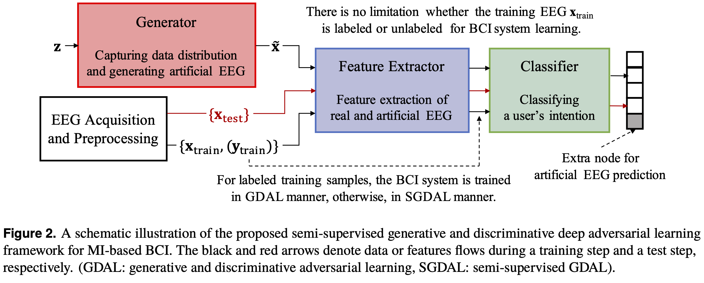

## Semi-Supervised Deep Adversarial Learning for Brain-Computer Interface

<p align="center"></p>

This repository provides a TensorFlow implementation of the following paper:
> **Semi-Supervised Deep Adversarial Learning for Brain-Computer Interface**<br>
> [Wonjun Ko](https://scholar.google.com/citations?user=Fvzg1_sAAAAJ&hl=ko&oi=ao)<sup>1</sup>, [Eunjin Jeon](https://scholar.google.com/citations?user=U_hg5B0AAAAJ&hl=ko)<sup>1</sup>, Jiyeon Lee<sup>1</sup>, and [Heung-Il Suk](https://scholar.google.co.kr/citations?user=dl_oZLwAAAAJ&hl=ko)<sup>1, 2</sup><br/>
> (<sup>1</sup>Department of Brain and Cognitive Engineering, Korea University) <br/>
> (<sup>2</sup>Department of Artificial Intelligence, Korea University) <br/>
> Official version: https://ieeexplore.ieee.org/document/8737345 <br/>
> Presented in the 7th IEEE International Winter Conference on Brain-Computer Interface (BCI)
> 
> **Abstract:** *Recent advances in deep learning have made a progressive impact on BCI researches. In particular, convolutional neural networks (CNNs) with different architectural forms have been studied for spatio-temporal or spatio-spectral feature representation learning. However, there still remain many challenges and limitations due to the necessity of a large annotated training samples for robustness. In this paper, we propose a semi-supervised deep adversarial learning framework that effectively utilizes generated artificial samples along with labeled and unlabelled real samples in discovering class-discriminative features to boost robustness of a classifier, thus to enhance BCI performance. It is also noteworthy that the proposed framework allows to exploit unlabelled real samples to better uncover the underlying patterns inherent in a user’s EEG signals. In order to justify the validity of the proposed framework, we conducted exhaustive experiments with ‘Recurrent Spatio-Temporal Neural Network’ CNN architectures over the public BCI Competition IV-IIa dataset. From our experiments, we could observe statistically significant improvements on performance, compared to the competing methods with the conventional framework. We have also visualized learned convolutional weights in terms of activation pattern maps, separability of extracted features, and validity of generated artificial samples.*

and

> **Semi-Supervised Generative and Discriminative Adversarial Learning for Motor Imagery-based Brain–Computer Interface**<br>
> [Wonjun Ko](https://scholar.google.com/citations?user=Fvzg1_sAAAAJ&hl=ko&oi=ao)<sup>1</sup>, [Eunjin Jeon](https://scholar.google.com/citations?user=U_hg5B0AAAAJ&hl=ko)<sup>1</sup>, [Jee Seok Yoon](https://scholar.google.com/citations?user=YjaJ5qQAAAAJ&hl=ko)<sup>1</sup>, and [Heung-Il Suk](https://scholar.google.co.kr/citations?user=dl_oZLwAAAAJ&hl=ko)<sup>1, 2</sup><br/>
> (<sup>1</sup>Department of Brain and Cognitive Engineering, Korea University) <br/>
> (<sup>2</sup>Department of Artificial Intelligence, Korea University) <br/>
> Official version: TBA <br/>
> Published in Scientific Reports (2020 JCR-IF: 4.380, Multidisciplinary Science: 17/72)
> 
> **Abstract:** *Convolutional neural networks (CNNs), which can recognize structural/configuration patterns in data with different architectures, have been studied for feature extraction. However, challenges remain regarding leveraging advanced deep learning methods in BCIs. We focus on problems of small-sized training samples and interpretability of the learned parameters and leverages a semi-supervised generative and discriminative learning framework that effectively utilizes synthesized samples with real samples to discover class-discriminative features. Our framework learns the distributional characteristics of EEG signals in an embedding space using a generative model. By using artificially generated and real EEG signals, our framework finds class-discriminative spatio-temporal feature representations that help to correctly discriminate input EEG signals. It is noteworthy that the framework facilitates the exploitation of real, unlabeled samples to better uncover the underlying patterns inherent in a user’s EEG signals. To validate our framework, we conducted experiments comparing our method with conventional linear models by utilizing variants of three existing CNN architectures as generator networks and measuring the performance on three public datasets. Our framework exhibited statistically significant improvements over the competing methods. We investigated the learned network via activation pattern maps and visualized generated artificial samples to empirically justify the stability and neurophysiological plausibility of our model.*

## Dependencies
* [Python 3.6+](https://www.continuum.io/downloads)
* [TensorFlow 1.5.0+](https://www.tensorflow.org/)

## Downloading datasets
To download BCI Competition IV-2A dataset
* https://www.bbci.de/competition/iv/

## Usage
`network.py` contains the proposed deep learning architectures, `utils.py` contains functions used for experimental procedures, and `experiment.py` contains the main experimental functions.

## Citation
If you find this work useful for your research, please cite our [paper](https://ieeexplore.ieee.org/abstract/document/9061668):
```
@inproceedings{ko2019semi,
  title={Semi-supervised deep adversarial learning for brain-computer interface},
  author={Ko, Wonjun and Jeon, Eunjin and Lee, Jiyeon and Suk, Heung-Il},
  booktitle={2019 7th international winter conference on brain-computer interface (BCI)},
  pages={1--4},
  year={2019},
  organization={IEEE}
}
```

and TBA:
```
TBA
}
```


## Acknowledgements
This work was supported by the Institute of Information & Communications Technology Planning & Evaluation (IITP) grant funded by the Korea government (No. 2017-0-00451 and Development of BCI based Brain and Cognitive Computing Technology for Recognizing User’s Intentions using Deep Learning).
